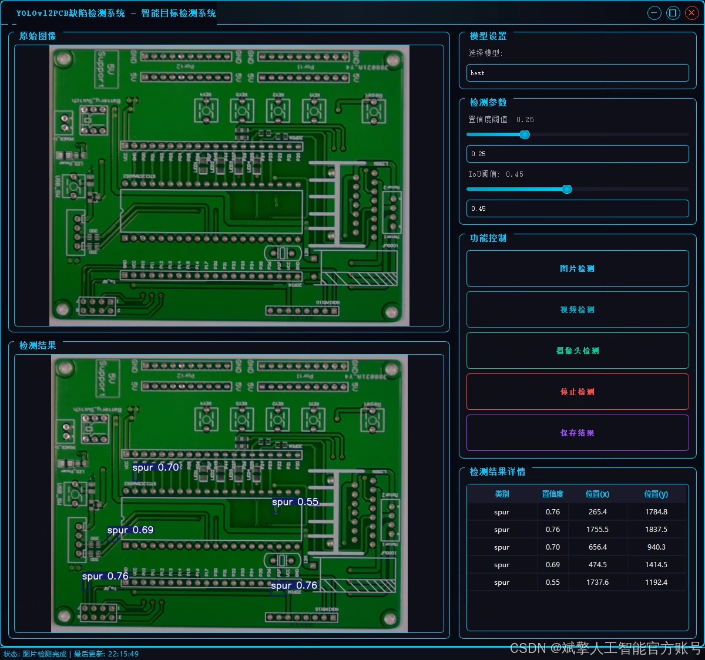
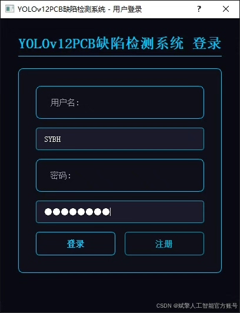
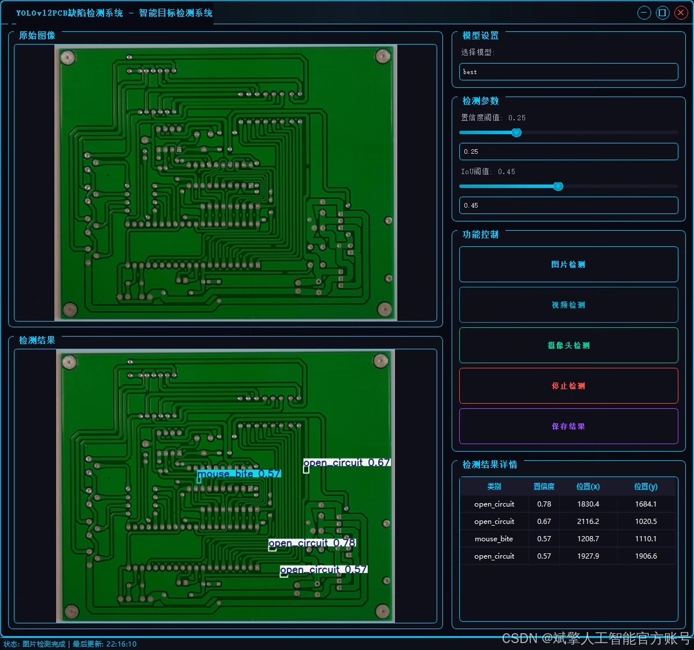
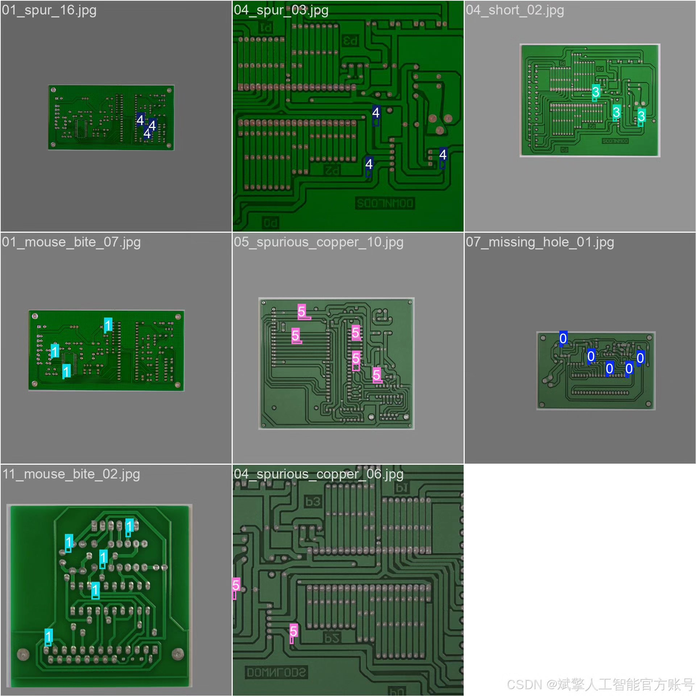
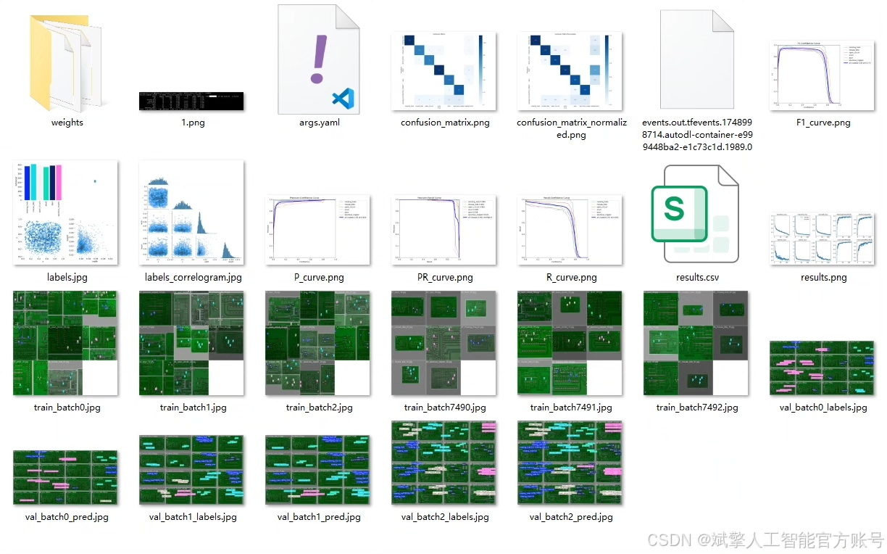
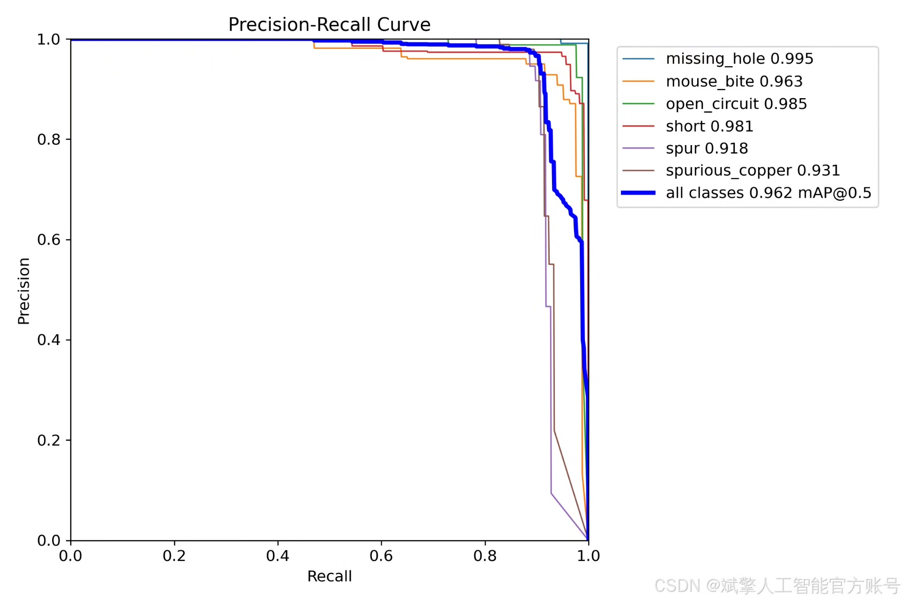
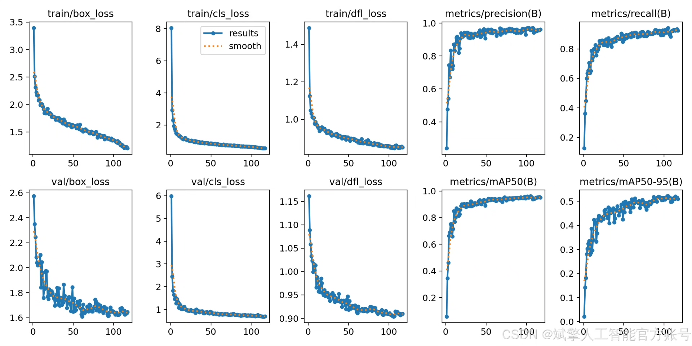
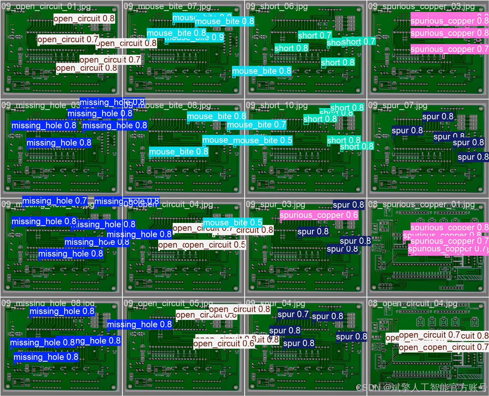

# YOLOv12 PCB Defect Detection System

## Body

YOLOv12 PCB Defect Detection System Based on Deep Learning YOLOv12

This paper designs and implements a PCB board defect detection system based on the deep learning YOLOv12 algorithm. The aim is to automate the identification of six common defects, including missing holes (missing_hole), mouse bites (mouse_bite), open circuits (open_circuit), short circuits (short), burrs (spur), and spurious copper (spurious_copper). The system utilizes the YOLOv12 model for efficient target detection, combined with a customized YOLO format dataset for training, ensuring high accuracy and robustness. Front-end development has created a user-friendly UI interface with login and registration functions, safeguarding data security. The project provides complete Python source code and pre-trained models, facilitating industrial deployment and secondary development. Experimental results show that the system can quickly locate and classify defects in complex PCB images, significantly improving detection efficiency and accuracy, suitable for quality control scenarios in the electronic manufacturing field.

Dataset:
nc: 6 classes,
Name: ["missing_hole", "mouse_bite", "open_circuit", "short", "spur", "spurious_copper"],
Dataset quantity: 554 training sets, 139 validation sets.

✅ User Login and Registration: Supports password verification and security validation.
✅ Three Detection Modes: Based on the YOLOv12 model, supports image, video, and real-time camera detection, accurately identifying targets.
✅ Dual Screen Comparison: Displays original images and detection results on the same screen.
✅ Data Visualization: Real-time table displaying the category, confidence, and coordinates of detected targets.
✅ Intelligent Parameter Tuning: Offers a confidence slide bar, dynamically optimizing detection accuracy to meet different scene requirements.
✅ Sci-Fi Style Interactive Interface: Dark theme paired with dynamic light effects, reducing visual fatigue and enhancing operational experience.

## Images

## Payment

Here is a pay link on Stripe ( https://buy.stripe.com/3cs8yP7sY87d0vu9AB ). Please contact me lonlonago@foxmail.com after funding $89, and I will send you a complete data files , thank you!

